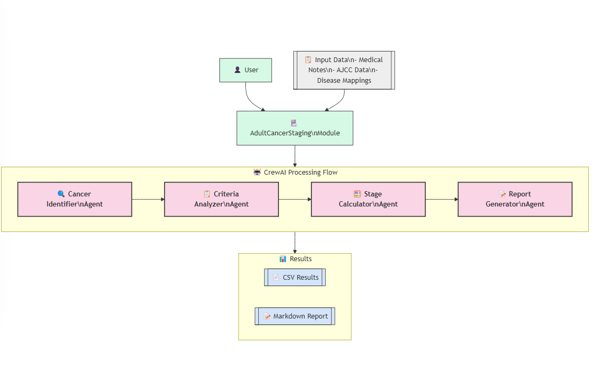

# Methodology: Adult Cancer Staging with Multi-Agent Architecture

## Overview

This document outlines the methodology behind the Adult Cancer Staging Module, which uses a multi-agent architecture powered by CrewAI to automatically analyze medical notes and determine appropriate cancer staging based on the American Joint Committee on Cancer (AJCC) 8th Edition staging system for adult cancers.

## AJCC 8th Edition Staging Data Generation

### Process

The AJCC 8th Edition staging data was generated using a two-phase approach:

1. **Initial Data Extraction (GPT-4.5)**:
   - Large language model GPT-4.5 with "Deep Research" capabilities was used to extract and organize data from the AJCC 8th Edition cancer staging guidelines
   - The prompt instructed the model to create a structured JSON file containing all types of adult cancers with their staging criteria
   - For each cancer type, the model extracted:
     - Disease name and category
     - TNM classification criteria for both clinical and pathologic staging
     - Stage groupings with detailed explanations optimized for LLM understanding
     - Relevant definitions and clarifications for each cancer type

2. **Data Refinement**:
   - The initial JSON file required structural fixes to ensure proper JSON syntax
   - A fixed version of the staging data was created with proper JSON structure while preserving all the original content
   - The fix_json_syntax method handles common issues such as unquoted property keys and trailing commas
   - Additionally, a comprehensive disease mappings CSV file was created with over 400 disease variations to enhance cancer type identification

The system leverages both the structured AJCC8.json data and the flexible disease_mappings.csv file to support a wide range of cancer type variations and expressions found in clinical notes.

## Multi-Agent Architecture

The module employs a multi-agent architecture using the CrewAI framework, where specialized AI agents work together to process medical notes and determine appropriate cancer staging.

### Agent Specialization

The system consists of four specialized agents, each with a specific role in the staging workflow:

1. **Cancer Identifier Agent**
   - **Role**: Oncology Specialist
   - **Goal**: Identify the specific cancer type and any mentioned TNM values in medical notes, verifying the cancer exists in AJCC 8th Edition
   - **Responsibility**: Analyze medical notes to determine which cancer type is applicable, match it to an AJCC category using the disease mappings, and extract any existing TNM values
   - **Output**: Cancer type, cancer category, TNM values, and whether to proceed with staging

2. **Criteria Analyzer Agent**
   - **Role**: AJCC Cancer Staging Specialist
   - **Goal**: Identify which staging criteria are present in the medical notes for the identified cancer type
   - **Responsibility**: Meticulously analyze medical notes for evidence of each staging criterion relevant to the identified cancer type, distinguishing between clinical and pathologic findings
   - **Output**: Detailed analysis of which criteria are present, including supporting evidence from the medical note

3. **Stage Calculator Agent**
   - **Role**: Cancer Stage Calculator
   - **Goal**: Calculate the clinical and pathologic stages based on identified criteria using AJCC 8th Edition
   - **Responsibility**: Apply the AJCC staging rules to determine the appropriate clinical and pathologic stages based on the criteria identified in the previous step
   - **Output**: Clinical stage, pathologic stage, and explanation of the staging decision

4. **Report Generator Agent**
   - **Role**: Cancer Staging Report Specialist
   - **Goal**: Generate comprehensive and accurate staging reports for all cancer types
   - **Responsibility**: Create a professionally formatted report explaining the staging decision, suitable for inclusion in a patient's medical record
   - **Output**: Comprehensive cancer staging report with all relevant details

Each agent uses the OpenAI `gpt-4o-mini` model for inference, with specialized prompting based on their specific role and task.

### Workflow Process

The staging process follows these sequential steps:

1. **Data Loading**:
   - The application loads the AJCC staging data from the JSON file
   - The disease mappings are loaded from the CSV file
   - If any JSON syntax errors are encountered, the system attempts to fix them automatically

2. **Medical Note Processing**:
   - The medical note is read from the specified file
   - The note is passed to the Cancer Identifier Agent

3. **Cancer Identification**:
   - The Cancer Identifier Agent analyzes the note to identify the cancer type and any TNM values
   - The identified cancer type is matched to an AJCC category using the disease mappings
   - The system verifies that the cancer category exists in the AJCC 8th Edition staging system
   - If the cancer doesn't exist in AJCC 8th Edition, the process stops here

4. **Criteria Analysis**:
   - The Criteria Analyzer Agent examines the note for specific staging criteria relevant to the identified cancer type
   - The agent produces a detailed analysis, distinguishing between clinical and pathologic findings
   - This analysis is passed to the Stage Calculator Agent

5. **Stage Calculation**:
   - The Stage Calculator Agent applies the AJCC 8th Edition staging rules to determine both clinical and pathologic stages
   - If information is insufficient for either stage, the agent indicates this in the output
   - The agent provides a detailed explanation for the staging decision
   - This information is passed to the Report Generator Agent

6. **Report Generation**:
   - The Report Generator Agent creates a comprehensive staging report
   - The report includes all relevant details about the cancer type, staging, and the reasoning behind the staging decision

7. **Output Generation**:
   - The system generates both CSV and markdown outputs with timestamps
   - The markdown output includes the full medical note and explanations of staging terminology
   - All outputs are saved to a "results" folder with datetime stamps
   - The status is updated in `project_status.md`

## Technical Implementation

### CrewAI Integration

The system uses CrewAI to orchestrate the multi-agent workflow. Key components include:

- **Agent Class**: Each agent is instantiated as a CrewAI `Agent` object with specific role, goal, and backstory
- **Task Class**: Tasks are defined using CrewAI's `Task` class, with detailed descriptions and expected outputs
- **Crew Class**: For each step in the workflow, a `Crew` is created with the appropriate agent and task, and then executed

### Cancer Type Identification and Mapping

A key innovation of the system is its robust cancer type identification and mapping capabilities:

- **Disease Mappings CSV**: Contains over 400 disease variations mapped to their canonical AJCC categories
- **Intelligent Matching**: Uses word overlap scoring and keyword-based matching to handle variations in how cancers are described
- **Fallback Mechanisms**: If the CSV file isn't available, creates basic mappings for common cancer types

### Error Handling

The system implements robust error handling:

- **JSON Parsing**: The module automatically attempts to fix JSON syntax errors when loading the staging data
- **Missing Data**: If crucial information is missing from medical notes, the Stage Calculator Agent indicates that information is insufficient
- **Category Verification**: Verifies that identified cancer types exist in the AJCC 8th Edition before proceeding with staging
- **Process Failures**: Exception handling is implemented throughout the workflow to catch and report errors

### Output Generation

The system produces comprehensive outputs:

- **CSV Output**: Contains structured data for each processed note
- **Markdown Reports**: Include detailed staging information, explanations, and the complete medical note
- **Timestamp Organization**: All outputs include datetime stamps for better organization
- **Explanatory Notes**: Markdown reports include explanations of staging terminology to help readers understand the results

### Telemetry Control

The application includes functionality to disable CrewAI's telemetry:

```python
def noop(*args, **kwargs):
    pass

def disable_crewai_telemetry():
    for attr in dir(Telemetry):
        if callable(getattr(Telemetry, attr)) and not attr.startswith("__"):
            setattr(Telemetry, attr, noop)
```

## System Architecture Diagram

```mermaid
image.png
```

# simplified mermaid
```
flowchart TB
    %% Styling with larger fonts and simplified colors
    classDef agentNode fill:#f9d5e5,stroke:#333,stroke-width:2px,color:#333,font-weight:bold,font-size:20px
    classDef dataNode fill:#eeeeee,stroke:#333,stroke-width:1px,color:#333,font-size:20px
    classDef processNode fill:#d5f9e5,stroke:#333,stroke-width:1px,color:#333,font-size:20px
    classDef outputNode fill:#d5e5f9,stroke:#333,stroke-width:1px,color:#333,font-size:20px

    %% Input Data - Simplified
    InputData[["📋 Input Data"]]:::dataNode
    
    %% Main Module - Simplified
    MainModule["🏥 Adult Cancer Staging Module"]:::processNode
    
    %% The Agents - Simplified but descriptive
    AgentIdentifier["🔍 Cancer Identifier Agent"]:::agentNode
    AgentCriteria["📋 Criteria Analyzer Agent"]:::agentNode
    AgentCalculator["🧮 Stage Calculator Agent"]:::agentNode
    AgentReport["📝 Report Generator Agent"]:::agentNode
    
    %% Process Steps - Simplified 
    ProcessIdentify["Identify Cancer Type"]:::processNode
    ProcessAnalyze["Analyze Criteria"]:::processNode
    ProcessCalculate["Calculate Stages"]:::processNode
    ProcessReport["Generate Reports"]:::processNode
    
    %% Final Output - Simplified
    OutputCSV[["📄 CSV Results"]]:::outputNode
    OutputMD[["📝 Markdown Reports"]]:::outputNode
    
    %% Connections - Simplified flow
    InputData --> MainModule
    MainModule --> AgentIdentifier
    AgentIdentifier --> ProcessIdentify
    ProcessIdentify --> ProcessAnalyze
    
    AgentCriteria --> ProcessAnalyze
    ProcessAnalyze --> ProcessCalculate
    
    AgentCalculator --> ProcessCalculate
    ProcessCalculate --> ProcessReport
    
    AgentReport --> ProcessReport
    ProcessReport --> OutputCSV
    ProcessReport --> OutputMD
    
    %% Agents Framework - Simplified
    subgraph Agents ["🤖 Agent Framework"]
        AgentIdentifier
        AgentCriteria
        AgentCalculator
        AgentReport
    end
    
    %% Process Flow - Simplified
    subgraph ProcessFlow ["🔄 Process Flow"]
        ProcessIdentify --> ProcessAnalyze --> ProcessCalculate --> ProcessReport
    end
```




## Conclusion

The Adult Cancer Staging Module demonstrates the power of multi-agent architectures for complex medical tasks. By breaking down the staging process into specialized agents with distinct responsibilities, the system can process medical notes comprehensively and produce accurate staging information based on the AJCC 8th Edition staging system.

The approach showcases how large language models can be effectively integrated into clinical workflows to assist with complex decision-making tasks, while maintaining a clear explanation of the reasoning process. The addition of the disease mappings CSV file and intelligent matching algorithms significantly enhances the system's ability to correctly identify and categorize a wide range of cancer types described in various ways in clinical notes.

Key innovations in this system include:
1. The comprehensive disease mappings with over 400 variations
2. The removal of hardcoded cancer-specific references in favor of a data-driven approach
3. The dual output format (CSV and markdown) with timestamp organization
4. The inclusion of explanatory notes to help readers understand cancer staging terminology

These features make the system not only powerful for clinical use but also educational for users who may not be familiar with the AJCC staging system. 